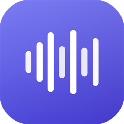

<div align="center">



# 🎧 HeyGen Audio &amp; Video Extractor

</div>

A simple Chrome extension that finds the **audio** and the **rendered video** in your HeyGen draft and lets you **play and download them right inside the extension**, with one click.

No copying. No opening tabs. Just **Fetch**, listen/preview, and download. ✨

The popup has **two tabs**:
- 🎵 **Audio** — every voiceover chunk from your draft.
- 🎬 **Video** — the final rendered scene video (available once the scene is fully rendered).

> 👨‍💻 Built by **Muhammad Abdullah Awais** · Full Stack Developer · 🌐 [www.abdullahawais.com](https://www.abdullahawais.com)

---

# 📌 What This Extension Does

When you create a video on **HeyGen**, the voiceover is made up of several audio pieces. This extension collects them for you and shows each one as a ready-to-use audio file.

Here is the simple idea:

1. ✅ Open your HeyGen video draft.
2. ✅ Make sure the voice has already been generated.
3. ✅ Click the extension icon.
4. ✅ Click the **"Fetch Audio"** button.
5. ✅ The extension finds every audio file and lists them as **Audio 1, Audio 2, Audio 3, …**
6. ✅ **Play** any audio right inside the extension to preview it.
7. ✅ **Download** each one with a single click, or use **Download All**.
8. ✅ Combine the downloaded pieces in your favorite editing software.

---

## ⚠️ Very Important: Please Read This

Your voiceover is made of **several separate audio pieces (chunks)**, not one single file.

Think of it like a song split into short clips. To get the complete voiceover, you need **all the clips, in order**.

> ❗ **This extension does NOT join the audio files for you.**
>
> It **finds, previews, and downloads** them. You then put them together in any audio or video editor, for example:

- 🎬 Adobe Premiere Pro
- 📱 CapCut
- 🎞️ DaVinci Resolve
- 🎚️ Audacity
- 🎵 Any other audio or video editor

---

# 💾 Installation Guide

You only need to install this extension **once**. Pick the option that feels easiest for you.

## ✅ Option 1: Download ZIP from GitHub (Easiest & Recommended)

Follow these steps slowly, one at a time:

1. Open the **GitHub page** for this project in your browser.
2. Look for the green button that says **"Code"** and click it.
3. In the small menu that opens, click **"Download ZIP"**.
4. Find the downloaded ZIP file (usually in your **Downloads** folder).
5. **Right-click** the ZIP file and choose **"Extract All"** (or "Unzip").
6. Move the extracted folder to a safe place, for example your **Documents** folder.

> 💡 **Tip:** Pick a folder where you keep important files and won't accidentally delete it.

> ⚠️ **Important:** After you install the extension (in the steps further below), **do not move or delete this folder.** If you move or delete it, the extension will stop working.

---

## ✅ Option 2: Clone Using Git (For Technical Users)

If you are comfortable using Git, you can clone the project instead:

```bash
git clone https://github.com/m-abdullah-awais/Heygen-ai-audio-extractor-v1.git
```

Then continue with the **"Load the Extension into Chrome"** section below.

---

# 🧩 Load the Extension into Chrome

Now let's add the extension to your Chrome browser. Just follow along:

### 1. Open Google Chrome

Open your Chrome browser like you normally do.

### 2. Go to the Extensions Page

In the address bar at the top, type the following and press **Enter**:

```
chrome://extensions
```

### 3. Turn On "Developer Mode"

Look at the **top-right corner** of the page. You will see a switch called **"Developer mode"**. Click it to turn it **ON**.

### 4. Click "Load Unpacked"

A few new buttons will appear. Click the one that says **"Load unpacked"**.

### 5. Select the Extension Folder

A window will open. Find and select the **folder you extracted earlier** (the one with the extension files inside). Then click **"Select Folder"**.

### 6. Confirm It Worked ✅

You should now see **"HeyGen Audio Extractor"** in your list of extensions. 🎉

### 7. Pin the Extension to Your Toolbar 📌

So you can open it with one click every time:

1. Click the **puzzle-piece icon** 🧩 at the **top-right** of Chrome (next to the address bar).
2. Find **"HeyGen Audio Extractor"** in the list.
3. Click the **pin icon** 📌 next to it.

The extension icon will now stay visible in your toolbar, ready whenever you need it. ✅

---

# 🚀 How to Use

Here is exactly how to use the extension, step by step.

### Step 1: Open HeyGen

Go to **[app.heygen.com](https://app.heygen.com)** and log in.

### Step 2: Open Your Video Project

Open the video project you have already created.

### Step 3: Open the Draft in Edit Mode

Open the video so you can see and **edit** it.

### Step 4: Make Sure There Is a Script

Check that your video already has a **script** (the text that becomes the voice).

### Step 5: Play the Video Once

Press **Play** and let the video play once.

> ⚠️ **Very Important:** Make sure the **voice/audio has finished generating**.
>
> If the voice is **not ready yet**, please **wait** until HeyGen finishes creating it. The extension can only find audio that already exists.

### Step 6: Click the Extension Icon

Click the **HeyGen Audio Extractor** icon in the top-right of Chrome.

### Step 7: Click "Fetch Audio"

In the popup window, click the **"Fetch Audio"** button.

### Step 8: See Your Audio Files

The extension lists everything it finds as **Audio 1, Audio 2, Audio 3, …** 🎵

The numbers follow the order the audio appears in your video, which matters when you combine them later.

### Step 9: Play and Download

- ▶️ Press **Play** on any item to preview it right inside the extension.
- ⬇️ Click **Download** on an item to save just that file.
- ⬇️ Click **Download All** to save every file at once.

---

# ⬇️ Downloading the Audio Files

Downloading is built right in, so you never have to open tabs or copy anything.

- **Download one file:** click the **Download** button next to that audio item.
- **Download everything:** click **Download All** at the top.

Files are saved automatically with friendly, ordered names:

```
audio-01.m4a
audio-02.m4a
audio-03.m4a
audio-04.mp3
```

> 💡 **Good to know:** The numbering matches the order shown in the extension (Audio 1 → `audio-01`, Audio 2 → `audio-02`, and so on). The extension keeps the original file format whenever possible.

> ⚠️ **Important — Keep the Order!**
>
> The audio pieces must stay in the **same order** (Audio 1, Audio 2, Audio 3, …) so they sound right when you join them together.

---

# 🎬 Combining the Audio Files

The files you downloaded are **separate pieces** of one voiceover. Now you will join them into a single audio track.

Here is the simple plan:

- ✅ Your downloaded files are separate audio pieces.
- ✅ They are already numbered in order (`audio-01`, `audio-02`, …).
- ✅ Open any audio or video editing software.
- ✅ **Import** all the audio files into it.
- ✅ Place them **one after another**, in the same order shown by the extension.
- ✅ **Export** the final, combined audio.

You can use any editor you are comfortable with, such as:

- 🎬 **Adobe Premiere Pro**
- 📱 **CapCut**
- 🎞️ **DaVinci Resolve**
- 🎚️ **Audacity**
- 🎵 **Any other audio or video editor**

> ❗ **Please Remember:** The extension finds, previews, and downloads your audio.
>
> **You** put the pieces together into one complete voice track.

---

# 🎬 Getting the Video (Rendered Scene)

The **Video** tab grabs the final rendered scene video from your HeyGen draft.

> ⚠️ **Most important rule:** the scene must be **fully rendered** before a video will appear. If you click Fetch Video too early, the extension will (correctly) find nothing.

Follow these steps in order:

### Step 1: Set Up Your Scene

Add your **script** and choose your **avatar** and **voice** in HeyGen.

### Step 2: Generate the Voice First

Open the **🎵 Audio** tab and **play / generate the voice** so the audio finishes rendering. (You can fetch the audio here too.)

### Step 3: Render the Scene

Once the voice is ready, **render the scene** by clicking the **Render Scene** button in HeyGen so the video finishes processing. Wait for it to complete.

### Step 4: Fetch the Video

Open the **🎬 Video** tab and click **"Fetch Video"**.

- The rendered video appears as **Video 1** with a built-in player.
- Press **Play** to preview it, then click **Download** (or **Download All**).
- The file is saved as `video-01-<number>.mp4`, matching your audio file numbering.

> 💡 **Still seeing "No video found"?** The scene isn't fully rendered yet. Let HeyGen finish, refresh the page if needed, then click **Fetch Video** again.

---

# 🛠️ Troubleshooting (Common Questions)

### ❓ No Audio Files Found

This can happen if:

- ⏳ The audio has **not been generated yet**.
- 📄 You are on the **wrong page**.
- 🔄 The page needs to be **refreshed**.
- ⌛ The video draft is **not fully loaded**.

> 💡 Try reloading the page, make sure the voice is ready, then click **Fetch Audio** again.

### ❓ No Video Found

This almost always means:

- 🎬 The scene is **not fully rendered yet** (the #1 reason).
- 🔄 The page needs to be **refreshed** after rendering finished.
- ⌛ You clicked **Fetch Video** before processing completed.

> 💡 Finish rendering the scene in HeyGen, wait until it's done, refresh if needed, then click **Fetch Video** again.

### ❓ Extension Not Working

This can happen if:

- 🧩 The extension was **not loaded correctly**.
- 🌐 You are **not on a supported HeyGen page** (it only works on `app.heygen.com`).
- 🔄 The browser simply needs a **refresh**.

> 💡 Try refreshing the page or reloading the extension from `chrome://extensions`.

### ❓ Audio Sounds Incomplete

This can happen if:

- ❌ **Not all** audio pieces were downloaded.
- 🔀 The pieces were placed in the **wrong order**.

> 💡 Double-check that you downloaded **every** item and arranged them in the **same order** as the extension (Audio 1, Audio 2, …).

---

# 📝 Important Notes

> Keep these simple rules in mind for the best results:
>
> - ✅ Always open the video in **Edit Mode**.
> - ✅ Always **check that the voice is ready** before clicking Fetch Audio.
> - ✅ **Download all** the audio pieces, don't skip any.
> - ✅ Keep the files in their **original order**.
> - ✅ **Refresh the page** if something doesn't work.
> - ✅ Do **not** skip any audio piece.

---

# 💬 Support

Need help or have a question? Feel free to reach out.

| | |
|---|---|
| 👨‍💻 **Developer** | Muhammad Abdullah Awais |
| 💼 **Role** | Full Stack Developer |
| 🌐 **Portfolio** | [www.abdullahawais.com](https://www.abdullahawais.com) |
| 💼 **LinkedIn** | [m-abdullah-awais-programmer](https://www.linkedin.com/in/m-abdullah-awais-programmer) |
| ▶️ **YouTube** | [@m_abdullah_awais](https://www.youtube.com/@m_abdullah_awais) |
| 📸 **Instagram** | [@m_abdullah_awais](https://www.instagram.com/m_abdullah_awais) |
| 🐙 **GitHub** | [m-abdullah-awais](https://github.com/m-abdullah-awais) |
| 📦 **Repository** | [Heygen-ai-audio-extractor-v1](https://github.com/m-abdullah-awais/Heygen-ai-audio-extractor-v1) |
| 📧 **Contact** | [contact@abdullahawais.com](mailto:contact@abdullahawais.com) |

---

<div align="center">

### Muhammad Abdullah Awais

**Full Stack Developer**

🌐 [www.abdullahawais.com](https://www.abdullahawais.com) &nbsp;•&nbsp; 📧 [contact@abdullahawais.com](mailto:contact@abdullahawais.com)

[](https://www.linkedin.com/in/m-abdullah-awais-programmer)
[](https://www.youtube.com/@m_abdullah_awais)
[](https://www.instagram.com/m_abdullah_awais)

---

⭐ *If this extension helped you, please consider giving the repository a star on GitHub!*

© Muhammad Abdullah Awais. All rights reserved.

</div>
